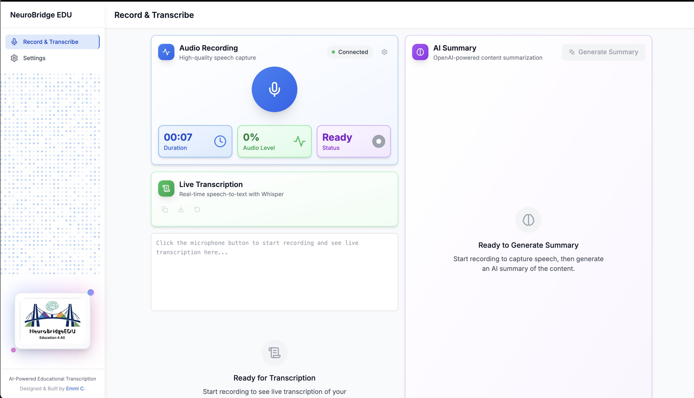

# 🧠 NeuroBridge EDU - Open Source Edition

<div align="center">
  
</div>

**Real-time AI-powered transcription and summarization for everyone.** 

The open source version of NeuroBridge EDU provides professional-grade speech-to-text transcription using **local Whisper models** with OpenAI API fallback and intelligent GPT-4 summarization, designed for individual users, researchers, content creators, and small organizations who need privacy-focused, cost-effective transcription capabilities.

## ✨ Core Features

- **🎙️ Professional Audio Recording** - Real-time microphone capture with advanced audio processing
- **🏠 Local Whisper Processing** - Privacy-first local transcription with 4x faster performance
- **☁️ Hybrid Architecture** - Automatic fallback to OpenAI API for reliability
- **🧠 Intelligent AI Summarization** - GPT-4 powered content analysis and structuring
- **✏️ Edit Before Export** - Full summary editing capabilities with real-time preview
- **📤 Multiple Export Formats** - Download as PDF or Markdown files
- **🔑 Optional API Key** - OpenAI key only needed for summarization and API fallback
- **🔒 Privacy-First Design** - No data collection, local processing, complete control
- **⚡ Real-time Processing** - Sub-second local audio processing with live updates
- **💰 90% Cost Reduction** - Local processing dramatically reduces API usage

## 🚀 Quick Start

### Prerequisites
- **Node.js** 20+ and **Python** 3.11+
- **OpenAI API Key** ([Get one here](https://platform.openai.com/api-keys)) - Optional for summarization only
- **Modern Browser** with microphone access
- **4GB+ RAM** - Recommended for local Whisper models

### 1. Clone & Setup
```bash
git clone <repository-url>
cd NeuroBridge-OpenSource
cp .env.example .env
```

### 2. Install Dependencies
```bash
# Install frontend dependencies
npm install

# Install backend dependencies
cd python_backend
pip install -r requirements.txt
cd ..
```

### 3. Start the Application
```bash
# Terminal 1: Start Python backend (FastAPI)
cd python_backend
python -m uvicorn main:app --host 0.0.0.0 --port 3939 --reload

# Terminal 2: Start React frontend (Vite)
npm run dev:frontend
```

### 4. Configure & Use
1. **Open Browser**: Navigate to http://localhost:3131
2. **Start Recording**: Click record button - transcription works immediately with local Whisper!
3. **Add API Key** (Optional): For AI summarization, go to Settings → Add OpenAI API key
4. **Generate Summary**: Click "Generate Summary" when transcription is complete
5. **Edit & Export**: Edit the summary and download as PDF or Markdown

### 🌐 Application URLs
- **Frontend**: http://localhost:3131 (Main application)
- **API Documentation**: http://localhost:3939/docs (Interactive API docs)
- **Backend Health**: http://localhost:3939/health (System status)

> 📁 **Clean Codebase**: This repository has been optimized for clarity. Additional documentation, deployment guides, and development tools are preserved in the `Archive/` folder for reference.

## 🏗️ Architecture Overview

NeuroBridge EDU uses a **privacy-first, stateless architecture** with professional-grade audio processing and secure API key management:

```
┌──────────────────────┐   Real-time Audio   ┌─────────────────────┐   OpenAI API   ┌──────────────┐
│   React Frontend     │ ◄─────────────────► │   FastAPI Backend   │ ◄────────────► │   OpenAI     │
│   (Port 3131)        │                     │   (Port 3939)       │   (Fallback)   │   Platform   │
│                      │   HTTP + SSE        │                     │                │              │
│ • Audio Capture      │                     │ • 🏠 LOCAL WHISPER │   gpt-4 only   │ • GPT-4      │
│ • Real-time Display  │                     │ • faster-whisper   │                │ • Whisper    │
│ • Summary Editor     │                     │ • ☁️  API Fallback  │                │   (backup)   │
│ • Export Controls    │                     │ • Export Generation │                └──────────────┘
└──────────────────────┘                     └─────────────────────┘
        │                                              │
        │                                              ▼
        │                                    ┌──────────────────┐
        │                                    │ Encrypted Storage │
        └────────────────────────────────────► ~/.neurobridge/   │
              (No persistent summaries)      │ (API Keys Only)   │
                                             └──────────────────┘
                                                      │
                                                      ▼
                                             ┌──────────────────┐
                                             │ Whisper Models   │
                                             │ ~/.cache/whisper │
                                             │ (base: ~74MB)    │
                                             └──────────────────┘
```

### ✨ What Makes This Special

**🔒 Privacy-First Design**
- **Local Transcription**: Audio processed entirely on your machine with local Whisper
- **Stateless Processing**: No transcriptions or summaries stored in database
- **Local API Key Storage**: AES-256-GCM encrypted, never leaves your machine
- **No Data Collection**: Zero tracking, analytics, or external data sharing
- **Minimal Cloud Usage**: Only summarization uses OpenAI (90%+ reduction in API calls)

**🎯 Professional Audio Pipeline**
- **WebAudio API**: Custom AudioWorklet with real-time resampling (48kHz → 16kHz)
- **Smart Buffering**: Chunked upload with overlap for accuracy optimization
- **Hallucination Filtering**: Advanced pattern matching to remove Whisper artifacts
- **Voice Activity Detection**: Client-side silence detection with configurable thresholds

**⚡ Real-time Architecture**
- **HTTP Chunking**: Efficient audio streaming to backend
- **Server-Sent Events**: Live transcription updates without WebSocket complexity
- **Async Processing**: Non-blocking I/O for smooth real-time performance

## 🛠️ Technology Stack

### Frontend Architecture
- **React 18** with TypeScript - Modern component architecture with strict typing
- **Vite 7.0** - Lightning-fast build tool with HMR support
- **Tailwind CSS 3.3** - Utility-first styling with custom design system
- **Zustand** with Immer - Lightweight state management with immutable updates
- **Radix UI** - Accessible component primitives following WCAG 2.2 AA
- **WebAudio API** - Professional audio capture with custom AudioWorklet processing
- **Victory.js** - Real-time analytics and compression visualizations

### Backend Architecture
- **Python 3.11+** with async/await patterns
- **FastAPI** - High-performance API framework with automatic OpenAPI docs
- **SQLAlchemy 2.0** - Modern ORM with async database operations
- **SQLite** - Minimal database for sessions and settings (no user data)
- **Cryptography** - AES-256-GCM encryption for API key security
- **Server-Sent Events** - Real-time data streaming without WebSocket overhead

### AI & Processing
- **faster-whisper** - Local speech recognition (4x faster than OpenAI Whisper)
- **Local Model Management** - Automatic model downloading and GPU/CPU optimization
- **OpenAI Whisper API** - Intelligent fallback for reliability
- **OpenAI GPT-4** - Advanced language model for intelligent summarization  
- **Custom Audio Processing** - PCM16 handling, resampling, and noise reduction
- **Smart Hallucination Filtering** - Pattern matching to remove common Whisper artifacts
- **Hybrid Architecture** - Best of local privacy + cloud reliability

## 📋 System Requirements

### Development Environment
- **Node.js 20+** with npm 10+ (for frontend development)
- **Python 3.11+** with pip (for backend services)
- **Git** for version control and updates

### External Services
- **OpenAI API Key** with credits for GPT-4 summarization (Whisper API optional fallback)
- **Internet Connection** for model downloads (first run) and optional summarization
- **Local Processing**: Transcription works completely offline after initial setup

### Browser Requirements
- **Modern Browser** (Chrome 91+, Firefox 90+, Safari 14+, Edge 91+)
- **Microphone Access** permissions
- **JavaScript Enabled** for full functionality
- **HTTPS** required for microphone access in production

### Hardware Recommendations
- **RAM**: 4GB+ required for local Whisper (8GB+ recommended for larger models)
- **Storage**: 500MB for application + 74MB-1.5GB for Whisper models
- **CPU**: Multi-core recommended for fast local processing
- **GPU**: Optional NVIDIA GPU for 2-5x faster transcription
- **Microphone**: Any USB/built-in microphone (quality affects transcription accuracy)
- **Network**: Internet only needed for model downloads and optional summarization

## 🔧 Development

### Development Commands
```bash
# Frontend development
npm run dev:frontend        # Start dev server (port 3131)
npm run build              # Production build
npm run preview            # Preview build

# Code quality
npm run build              # TypeScript compilation check (recommended)
npm run test               # Run tests (requires Jest setup)
npm run test:watch         # Watch mode testing

# Note: Linting may require additional dev dependency installation

# Backend development
cd python_backend
python -m uvicorn main:app --reload --port 3939
```

### Docker Development
```bash
# Full application (CPU - includes local Whisper)
docker-compose up -d --build  # Build and run with base model
docker-compose logs -f        # View logs
docker-compose down          # Stop containers
docker-compose down -v && docker system prune -f  # Clean up

# GPU acceleration (faster local transcription)
docker-compose -f docker-compose.gpu.yml up -d --build
```

## 🎯 Complete User Workflow

### Initial Setup (One-time)
1. **🔑 Configure API Key**: Go to Settings → Add OpenAI API key (securely encrypted and stored locally)
2. **🎤 Test Microphone**: Verify browser permissions and audio levels
3. **✅ Validate Setup**: System automatically tests your API key functionality

### Recording & Transcription  
1. **🎙️ Start Recording**: Click the record button to begin audio capture
2. **📊 Monitor Levels**: Watch real-time audio level indicators for optimal input
3. **📝 Live Transcription**: See your speech converted to text in real-time
4. **⏹️ Stop Recording**: End recording when your session is complete

### AI Summary Generation
1. **🧠 Generate Summary**: Click "Generate Summary" to create AI-powered analysis
2. **📊 View Analytics**: See compression ratios and word count statistics
3. **✏️ Edit Content**: Use the built-in editor to refine and customize your summary
4. **🔍 Preview Changes**: Real-time markdown preview with professional formatting

### Export & Save
1. **📄 Choose Format**: Select PDF for documents or Markdown for code/notes
2. **⬇️ Download**: Files save directly to your computer with timestamp naming
3. **🔄 Iterate**: Generate new summaries or edit existing ones as needed

### Key Benefits
- **⚡ Real-time Processing**: See transcription appear as you speak
- **🎯 Intelligent Summarization**: AI understands context and creates structured summaries  
- **🔒 Complete Privacy**: No data stored on servers, all processing ephemeral
- **💰 Cost Transparency**: Only pay OpenAI API costs, no subscription fees

## 🔐 Secure API Key Management

NeuroBridge EDU implements **enterprise-grade security** for your OpenAI API keys with complete privacy protection.

### 🔑 Setting Up Your OpenAI API Key (Optional)

**✨ New**: Transcription works immediately without any API key! OpenAI key is only needed for AI summarization.

1. **Create OpenAI Account**: Visit [OpenAI Platform](https://platform.openai.com/signup)
2. **Generate API Key**: Navigate to API Keys section and create a new secret key
3. **Add to NeuroBridge**: Go to Settings → "Add API Key" → Paste your key
4. **Automatic Validation**: System tests key functionality with GPT-4
5. **Ready for Summaries**: Generate AI summaries after adding your key

**💡 Tip**: You can use NeuroBridge for transcription immediately without any setup - just click record!

### 🛡️ Military-Grade Security Features

**🔒 AES-256-GCM Encryption**
- All API keys encrypted before storage using authenticated encryption
- Unique encryption keys derived using HKDF (HMAC-based Key Derivation Function)
- Each key gets a unique nonce preventing replay attacks

**🏠 Local-Only Storage**
- Keys stored in `~/.neurobridge/` directory on your machine
- File permissions set to 0600 (owner read/write only)
- Never transmitted to external servers except OpenAI directly
- Zero data collection or key sharing with NeuroBridge developers

**👁️ Privacy-First UI**
- Keys displayed as `sk-••••••••••••••••••••1a2b` (only last 4 characters visible)
- Temporary reveal with auto-hide timer for verification
- In-memory processing only, never stored in browser localStorage

**✅ Smart Validation & Monitoring**
- Real-time API key testing with both Whisper and GPT-4 models
- Usage tracking (optional) to monitor your OpenAI costs
- Automatic key rotation support for enhanced security
- Duplicate prevention using HMAC fingerprinting

### 💰 Cost Control & Transparency

- **90% Cost Reduction**: Local Whisper eliminates most OpenAI API usage
- **Direct Billing**: Pay OpenAI directly for summarization only (no markup)
- **Usage Tracking**: Optional monitoring of API call costs
- **Rate Limiting**: Built-in limits to prevent accidental overuse
- **Efficient Processing**: Smart chunking and local processing minimize costs
- **Free Transcription**: Unlimited local transcription without API costs

> **🔐 Your Privacy Guarantee**: NeuroBridge developers never have access to your API keys or transcription data. Everything is processed locally or directly with OpenAI using your credentials.

## 🔒 Security Features

- **CORS Protection**: Configurable origins
- **Rate Limiting**: API endpoint protection  
- **Input Validation**: Comprehensive request validation
- **Error Handling**: Secure error messages
- **Environment Variables**: Sensitive data protection

## ⚙️ Configuration

### Environment Setup

Copy `.env.example` to `.env` and configure settings:

```bash
# === Core Application Settings ===
PORT=3939                                      # Backend server port
VITE_API_BASE_URL=http://localhost:3939       # Frontend API connection

# === Local Whisper Configuration ===
LOCAL_WHISPER_ENABLED=true                    # Enable local Whisper processing
LOCAL_WHISPER_MODEL_SIZE=base                 # tiny|base|small|medium|large-v2|large-v3
LOCAL_WHISPER_DEVICE=auto                     # auto|cpu|cuda|mps
TRANSCRIPTION_METHOD=local_first              # local_only|api_only|local_first|auto
WHISPER_CACHE=/app/.cache/whisper             # Model cache directory

# === AI Services (OPTIONAL) ===
# OPENAI_API_KEY=sk-your-key-here             # Can be set via Settings UI instead

# === Data Storage ===
DATABASE_PATH=./data/neurobridge.db          # SQLite database location

# === Security Configuration ===
JWT_SECRET=your-secure-jwt-secret-change-this # Change in production!
CORS_ORIGINS=http://localhost:3131,http://localhost:3939

# === Optional Features ===
# ENABLE_DEBUG_LOGGING=true                   # Verbose logging for development
# MAX_AUDIO_CHUNK_SIZE=1048576               # Audio chunk size in bytes
# TRANSCRIPTION_TIMEOUT=30                   # Timeout for API calls
```

### 🧠 Local Whisper Configuration

**Transcription Methods**:
- `local_only`: Use only local Whisper (fastest, most private)
- `api_only`: Use only OpenAI API (requires API key)
- `local_first`: Try local first, fallback to API (recommended)
- `auto`: Automatically choose best method based on performance

**Model Selection Guide**:
| Model | Size | Speed | Accuracy | Use Case |
|-------|------|-------|----------|----------|
| `tiny` | 39MB | ~32x faster | Good | Testing, resource-constrained |
| `base` | 74MB | ~16x faster | Better | **Default choice** |
| `small` | 244MB | ~6x faster | Very good | Production quality |
| `medium` | 769MB | ~2x faster | Excellent | High accuracy needed |
| `large-v3` | 1.5GB | 1x | Best | Maximum quality |

**Device Options**:
- `auto`: Automatically detect GPU/CPU (recommended)
- `cuda`: Force NVIDIA GPU (requires CUDA)
- `cpu`: Force CPU processing
- `mps`: Apple Silicon GPU acceleration

### 🔧 Configuration Options

**Recommended Approach**: Use the **Settings UI** for runtime configuration
- Live model switching without restarts
- Real-time performance monitoring
- Method selection with usage statistics
- Easy testing of local transcription capability

**Environment Variables**: Used for deployment and system configuration
- Default model sizes and processing methods
- Cache directories and storage paths
- Hardware acceleration preferences

### 🐳 Docker Deployment Options

**Standard CPU Deployment** (Recommended):
```bash
docker-compose up -d --build
# Includes: base model, CPU processing, automatic model download
# View logs: docker-compose logs -f
# Stop: docker-compose down
```

**GPU-Accelerated Deployment**:
```bash
docker-compose -f docker-compose.gpu.yml up -d --build
# Includes: small model, CUDA acceleration, 2-5x faster processing
# Requires: NVIDIA Docker runtime, 2GB+ VRAM
```

**Configuration Environment Variables** for Docker:
```bash
# In docker-compose.yml or docker-compose.gpu.yml
environment:
  - LOCAL_WHISPER_ENABLED=true
  - LOCAL_WHISPER_MODEL_SIZE=base        # or small for GPU
  - TRANSCRIPTION_METHOD=local_first
  - WHISPER_CACHE=/app/.cache/whisper
```


## 🔧 Troubleshooting Guide

### 🎤 Audio & Recording Issues

**Microphone Not Working**
```bash
# Check browser permissions
# Chrome: Settings → Privacy → Site Settings → Microphone
# Firefox: Preferences → Privacy & Security → Permissions → Microphone
```
- **HTTPS Required**: Microphone access requires HTTPS in production
- **Device Selection**: Use browser settings to select correct audio input
- **Permission Errors**: Clear browser data and re-grant microphone permissions

**Poor Transcription Quality**
- **Audio Levels**: Keep audio levels between -20dB to -6dB (watch the level meter)
- **Background Noise**: Use a quiet environment or noise-canceling microphone
- **Speaking Style**: Speak clearly with moderate pace (Whisper handles accents well)
- **Model Selection**: Try larger models (small/medium) for better accuracy
- **Processing Method**: Switch between local/API in Settings to compare results

### 🔑 API Key Issues

**API Key Validation Failures**
```bash
# Test your key directly with curl:
curl https://api.openai.com/v1/models \
  -H "Authorization: Bearer YOUR_API_KEY"
```
- **Invalid Key**: Ensure key starts with `sk-` and is copied completely
- **Insufficient Credits**: Check OpenAI account billing and usage limits
- **Model Access**: Verify your account has access to Whisper and GPT-4 models
- **Rate Limits**: Wait a few minutes if hitting OpenAI rate limits

### 🚀 Performance & Connection Issues

**Backend Connection Problems**
```bash
# Verify backend is running
curl http://localhost:3939/health

# Check backend logs
cd python_backend
python -m uvicorn main:app --reload --log-level debug
```
- **Port Conflicts**: Ensure ports 3131 and 3939 are available
- **CORS Errors**: Verify CORS_ORIGINS in .env matches frontend URL
- **Firewall Issues**: Allow network access for localhost ports

**Slow Processing**
- **OpenAI API Latency**: Processing time depends on OpenAI service load
- **Large Audio Files**: Consider shorter recording sessions for faster processing
- **Network Speed**: Ensure adequate upload bandwidth for audio chunks

### 🧠 Local Whisper Issues

**Model Download Failures**
```bash
# Check internet connectivity and disk space
curl -I https://huggingface.co/

# Manual model download test
cd python_backend
python -c "from faster_whisper import WhisperModel; WhisperModel('base')"
```
- **Disk Space**: Ensure 500MB-2GB free space depending on model size
- **Permissions**: Verify write access to cache directory (~/.cache/whisper)
- **Network**: Stable internet needed for initial model download only

**GPU Not Detected**
```bash
# Test CUDA availability
python -c "import torch; print(f'CUDA: {torch.cuda.is_available()}')"

# Test Docker GPU access
docker run --rm --gpus all nvidia/cuda:12.1-base-ubuntu22.04 nvidia-smi
```
- **NVIDIA Drivers**: Ensure CUDA 12.1+ compatible drivers installed
- **Docker GPU Runtime**: Install nvidia-docker2 package
- **Fallback**: System automatically falls back to CPU processing

**Local Processing Slow**
- **Model Size**: Use 'tiny' or 'base' for faster processing on limited hardware
- **Device**: Check Settings → Transcription Config to verify optimal device
- **Memory**: Ensure 4GB+ RAM available for model loading
- **Fallback**: Enable API fallback for reliability

**Configuration Issues**
```bash
# Test local Whisper capability
curl -X POST http://localhost:3939/api/transcription/test-local

# Check transcription config
curl http://localhost:3939/api/transcription/config

# View model status
curl http://localhost:3939/api/transcription/models
```

### 🔍 Development Debugging

**Debug Frontend Issues**
```bash
# Enable detailed logging
# Add to browser console:
localStorage.setItem('debug', 'neurobridge:*')

# View network requests
# Chrome DevTools → Network → Filter by 'chunk' or 'stream'
```

**Debug Backend Issues**
```bash
# Run with debug logging
cd python_backend
ENABLE_DEBUG_LOGGING=true python -m uvicorn main:app --reload --log-level debug

# Test API endpoints directly
curl -X POST http://localhost:3939/api/transcription/start

# Test local Whisper specifically
curl -X POST http://localhost:3939/api/transcription/test-local
```

**Database Issues**
```bash
# Reset database if corrupted
rm ./data/neurobridge.db
# Restart backend to recreate tables
```

### 📞 Getting Help

**Log Collection**
```bash
# Backend logs
cd python_backend && python -m uvicorn main:app --log-level debug 2>&1 | tee debug.log

# Frontend logs (Browser Console)
# Press F12 → Console tab → Save console output
```

**Common Solutions**
1. **Clear Browser Data**: Clear site data and cookies
2. **Restart Services**: Stop both frontend and backend, then restart
3. **Check Dependencies**: Run `npm install` and `pip install -r requirements.txt`
4. **Verify Environment**: Ensure `.env` file exists with correct settings
5. **Update Software**: Use latest versions of Node.js and Python

**Community Support**
- Check GitHub Issues for similar problems
- Review [CLAUDE.md](CLAUDE.md) for technical implementation details
- Join discussions for community help and troubleshooting tips

**Additional Resources**
- Archived documentation available in `Archive/` folder for advanced configuration
- Development guides and deployment scripts preserved for reference


## 📄 License & Legal

### NeuroBridge EDU Non-Commercial License

This project is open source for **personal, educational, and non-commercial use only**. 

**✅ PERMITTED USES:**
- Personal use and learning
- Educational use in non-commercial institutions  
- Academic research and publication
- Non-profit organization use
- Open source contributions and modifications

**❌ COMMERCIAL USE RESTRICTED:**
Commercial use requires explicit written permission. This includes:
- Using the software to provide paid services
- Incorporating into commercial products
- Commercial research or development
- Any use generating revenue or commercial advantage

**📧 COMMERCIAL LICENSING:**
For commercial use, contact: **neurobridgeedu@gmail.com**
Website: **https://neurobridgeedu.eu**

### Third-Party Services
- **OpenAI**: Requires separate account and API key ([Terms](https://openai.com/terms))
- **Audio Processing**: Uses Web Audio API (browser standard)
- **No Data Sharing**: Your transcriptions never leave your machine except to OpenAI directly

### Attribution
When using this software in academic publications or public works, please cite:
```
NeuroBridge EDU - AI-Powered Educational Transcription Platform
https://neurobridgeedu.eu
Contact: neurobridgeedu@gmail.com
```

See [LICENSE](LICENSE) file for complete terms and conditions.

## 🤝 Contributing & Development

### Quick Contribution Guide
1. **Fork** the repository on GitHub
2. **Clone** your fork: `git clone <your-fork-url>`
3. **Branch**: `git checkout -b feature/amazing-feature`
4. **Code**: Make your changes with tests
5. **Test**: Run `npm run build` and backend tests
6. **Commit**: `git commit -m 'feat: add amazing feature'`
7. **Push**: `git push origin feature/amazing-feature`
8. **PR**: Open a Pull Request with clear description

### Development Resources
- **Technical Details**: See [CLAUDE.md](CLAUDE.md) for architecture and implementation
- **API Documentation**: Visit http://localhost:3939/docs when running
- **Component Guide**: Frontend components in `src/components/`
- **Testing**: Run `cd python_backend && python run_tests.py --suite all`
- **Archived Docs**: Additional guides available in `Archive/docs/` for platform-specific setups

### Areas for Contribution
- **🔊 Audio Processing**: Enhanced noise reduction and voice activity detection
- **🧠 AI Features**: Additional local models, custom prompts, speaker diarization
- **⚡ Performance**: Model quantization, streaming inference, batch processing
- **🎯 Model Management**: UI for downloading/deleting models, performance monitoring
- **📱 Mobile Support**: Progressive Web App features, mobile-optimized UI
- **🌐 Internationalization**: Multi-language Whisper models, locale-specific features
- **🔧 DevOps**: Docker GPU optimization, deployment automation, monitoring
- **📚 Documentation**: Tutorials, examples, API documentation, model selection guides

### 🌟 Star & Share
If NeuroBridge EDU helps you, please ⭐ star the repository and share with others who might benefit from privacy-focused transcription!

---

**Built with ❤️ for privacy, accessibility, and open source innovation.**  
*Empowering individuals with professional-grade AI transcription without vendor lock-in.*